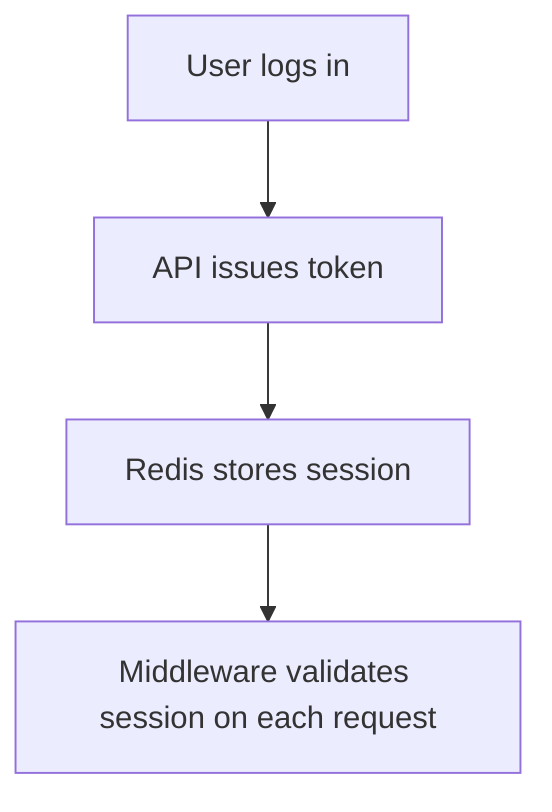

# <Feature Name> — Specification

**Date:** YYYY-MM-DD  
**Author:** <Your Name>  
**Related Issue / Ticket:** <#ID or URL>  
**Status:** Draft / In Review / Final  

---

## 1. Context
Describe the background and motivation for this feature.  
- What business or technical problem does it solve?  
- Why is it important now?  
- How does it fit into the existing system or roadmap?

_Example:_  
> Currently, the user session is lost after container restarts. We want to persist login sessions using Redis so that re-authentication isn’t required on every reload.

---

## 2. Goal
List the measurable outcomes or success criteria.  

**Example goals:**
- Maintain user session between app restarts.  
- No performance degradation above X ms response time.  
- Session persistence survives redeploys and cluster restarts.

---

## 3. Scope
**In Scope:**
- (List exactly what is covered)

**Out of Scope:**
- (List what is intentionally excluded)

---

## 4. Architecture / Design Overview
Describe the intended design approach.  
Use bullet points, diagrams, or short prose.  
Include patterns, relevant modules, and flow.

_Example:_
- Use Redis as external session storage.
- Add middleware to read/write tokens.
- Update `AuthService` for new persistence layer.


---

## 5. Integration Points
List affected or dependent parts of the system:

Backend modules or microservices
- External APIs
- Databases or schemas
- Environment variables or secrets

_Example:_
- `services/auth/*`
- `docker-compose.yml` (add `redis`)
- `.env` (add `REDIS_URL`)

---

## 6. Existing Code References
Describe where similar logic/patterns already exist to guide implementation consistency.

_Example:_
```
services/user/session_manager.py        # handles temporary tokens
services/api/middleware/auth_guard.py   # validates JWT
```

---

## 7. Risks & Alternatives
Describe the main risks, their impact, and mitigations. List credible alternative approaches and why they’re not chosen.

_Example Risk Table:_
```
| Risk                              | Impact | Mitigation                |
| --------------------------------- | ------ | ------------------------- |
| Redis outage causes auth failures | High   | Fallback to JWT-only mode |
| Token mismatch on migration       | Medium | Clear cache during deploy |

```

_Example Alternatives:_
- Store sessions in PostgreSQL instead of Redis.
- Use JWT with refresh tokens instead of server sessions.

---

## 8. References
Describe authoritative materials that inform this design (docs, ADRs, standards, prior art).

_Example:_
- Official library docs
- Company architecture guidelines
- Similar implementation in another repo

---

## 9. Acceptance Criteria (UAT)
Describe user-facing behaviors and system outcomes that must be verifiably true at completion.

_Example Checklist:_
 - [ ] Users remain logged in after server restarts
 - [ ] Session expiry works as configured
 - [ ] Token refresh within 100 ms average latency
 - [ ] Unit & integration tests pass in CI
 - [ ] No breaking changes to current API contracts

---

## 10. Open Questions
Describe unresolved items that need decisions or clarification before/during implementation.

_Example Questions:_
- Should session TTL be configurable per environment?
- Do we need to handle token rotation manually?

---

## 11. Definition of Done
Describe the completion criteria for this feature beyond UAT (docs, ADRs, plans).

_Example:_
 - [ ] This document reviewed and approved
 - [ ] Open questions resolved
 - [ ] Implementation Plan created in docs/plans/...
 - [ ] ADR added if architectural changes are introduced
 - [ ] Linked issue marked “Ready for Implementation”

---

## 12. Appendix (Optional)
Describe any supplemental material that supports implementation or testing.

_Example:_
```
# Example .env additions
REDIS_URL=redis://cache:6379/0
SESSION_TTL=3600
```


